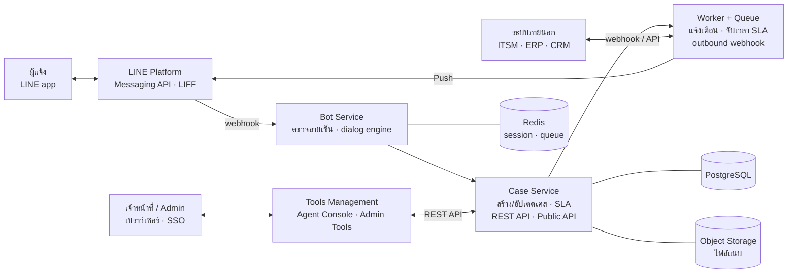
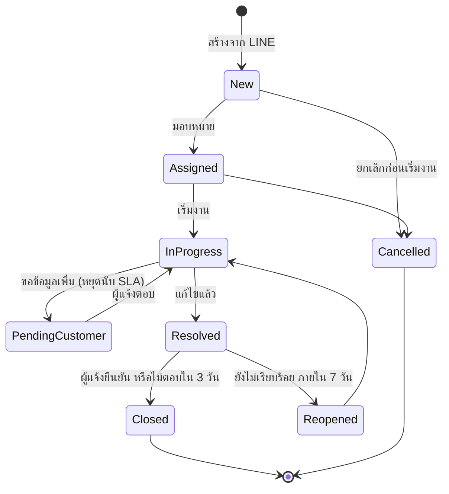

# Spec ระบบแจ้งเคสผ่าน LINE Bot และ Tools Management

ฉบับร่าง 29 ก.ย. 2569 · ผู้จัดทำ: Natthawat Boonchaiseree (HarmonyX)
เอกสารต้นฉบับ (แก้ไขร่วมกันได้): https://claude.ai/code/artifact/ed9d317a-ca64-43c5-85c9-59cb7129677e
Prototype หน้าจอ: https://claude.ai/artifact/Am5eiquq87PZQ83pjqX9ms (อนุมัติแล้ว 29 ก.ย. 2569 · เป็นแหล่งอ้างอิงหลักด้าน layout ข้อความ และ design token ส่วนเอกสารนี้กำหนดขอบเขตและกติกา · ไฟล์ส่งออกอยู่ใน `prototype/`)

## 1. ภาพรวมและขอบเขต

ผู้แจ้งเปิดเคสผ่าน LINE Official Account โดย bot ถามทีละข้อจนได้ข้อมูลครบ จากนั้นเคสเข้าสู่ Tools Management (web app) ให้เจ้าหน้าที่รับเรื่อง ตอบกลับ และปิดงาน ผู้ดูแลระบบปรับหมวดหมู่ คำถาม และ SLA ได้เองโดยไม่ต้องแก้โค้ด

**วัตถุประสงค์**

- ได้ข้อมูลครบตั้งแต่การแจ้งครั้งแรก ลดการถามกลับ
- ผู้แจ้งติดตามสถานะได้เองใน LINE โดยไม่ต้องโทรสอบถาม
- วัด SLA และความพึงพอใจได้ทุกเคส
- ทีมธุรกิจปรับ flow ของ bot ได้เองผ่าน web app

**ผู้ใช้งาน**

| บทบาท | ช่องทาง | สิ่งที่ทำ |
| --- | --- | --- |
| ผู้แจ้ง (Reporter) | LINE OA | ลงทะเบียน · แจ้งเคส · แนบรูป · ติดตามสถานะ · ประเมินความพึงพอใจ |
| เจ้าหน้าที่ (Agent) | Web app | รับเคส · ตอบกลับผ่าน LINE · บันทึกภายใน · เปลี่ยนสถานะ |
| หัวหน้าทีม (Supervisor) | Web app | มอบหมายงาน · ติดตาม SLA · อนุมัติการปิดเคส · ดูรายงาน |
| ผู้ดูแลระบบ (Admin) | Web app | ตั้งค่า bot flow · หมวดหมู่ · SLA · ผู้ใช้และสิทธิ์ · การเชื่อมต่อระบบ |

**อยู่ในขอบเขต:** LINE bot แบบถามตอบ · ระบบบริหารเคส · Tools Management · การแจ้งเตือน · รายงาน

**นอกขอบเขตระยะแรก:** voice/video call · การเชื่อมต่อช่องทางอื่น (Facebook, email inbound) · AI ตอบคำถามอัตโนมัติเต็มรูปแบบ (อยู่ใน Phase 3)

## 2. สถาปัตยกรรมระบบ

Bot Service รับข้อความจาก LINE และถามตอบจนได้ข้อมูลครบ แล้วส่งให้ Case Service ซึ่งเป็นจุดเดียวที่สร้างและเปลี่ยนสถานะเคส ทั้ง web app และระบบภายนอกเรียกผ่าน API ชุดเดียวกัน งานที่ไม่ต้องตอบทันที (แจ้งเตือน · จับเวลา SLA · webhook) ทำใน Worker ผ่าน queue

**Tech stack ที่เสนอ** (สถาปัตยกรรมเป้าหมาย MVP สำหรับทดสอบกับผู้ใช้ใช้รูปแบบย่อตาม `docs/adr/0001`–`0005` คือ Next.js แอปเดียว + PostgreSQL ก่อนใช้งานจริงต้องย้ายกลับมาตามตารางนี้)

| ชั้น | เทคโนโลยี | เหตุผล |
| --- | --- | --- |
| Bot / Case Service | Node.js + TypeScript (NestJS) · LINE Messaging API SDK | SDK ทางการของ LINE · ทีมเดียวดูแลทั้ง backend และ frontend |
| Web App | Next.js + React · shadcn/ui · TanStack Table | ทำหน้ารายการเคสและตัวกรองได้เร็ว |
| ฐานข้อมูล | PostgreSQL | JSONB รองรับคำตอบแบบยืดหยุ่น · ค้นหาและทำรายงานได้ดี |
| Session / Queue | Redis + BullMQ | เก็บสถานะบทสนทนาพร้อม TTL · งาน async และ retry |
| ไฟล์แนบ | S3-compatible (AWS S3 หรือ MinIO กรณี on-premise) | ย้าย hosting ได้โดยไม่แก้โค้ด |
| Authentication | OIDC (Keycloak หรือ Entra ID) | รองรับ SSO และ MFA |
| Deploy | Docker · CI/CD ด้วย GitHub Actions · VM เดียวสำหรับ MVP แล้วขยายเป็น Kubernetes | เริ่มต้นต้นทุนต่ำ ขยายได้เมื่อปริมาณเพิ่ม |
| Monitoring | OpenTelemetry · Grafana/Loki · Sentry | ติดตาม webhook ล้มเหลวและ error ของ bot |

## 3. LINE Bot: การถามตอบเพื่อแจ้งเคส

Bot ทำงานแบบ form-driven dialog คือถามตามแบบฟอร์มที่ผูกกับหมวดหมู่ โดยแบบฟอร์มทั้งหมดกำหนดใน Tools Management ไม่ได้เขียนตายตัวในโค้ด

**Rich Menu (4 ปุ่ม):** แจ้งปัญหาใหม่ · ติดตามสถานะ · เคสของฉัน · ติดต่อเจ้าหน้าที่

**ลงทะเบียนครั้งแรก**

1. ผู้ใช้เพิ่มเพื่อน LINE OA ระบบบันทึก `userId` และแสดงประกาศความเป็นส่วนตัว (PDPA) ให้กดรับทราบ การรับเรื่องอาศัยฐาน "ให้บริการตามที่ร้องขอ" ตามมาตรา 24 ไม่บังคับความยินยอมเป็นเงื่อนไขการใช้บริการ (D-014 · รอฝ่ายกฎหมายยืนยัน)
2. กรอกชื่อ · เบอร์โทร · หน่วยงานหรือรหัสลูกค้า ผ่าน LIFF form (ตรวจรูปแบบได้ดีกว่าการพิมพ์ในแชท)
3. ยืนยันเบอร์โทรด้วย OTP (เลือกเปิดได้ตามลูกค้า)

**Flow แจ้งเคส**

1. เลือกหมวดหมู่หลักจาก Quick Reply หรือ Flex carousel
2. เลือกหมวดย่อย ระบบโหลดแบบฟอร์มของหมวดนั้น
3. Bot ถามทีละข้อตามลำดับที่กำหนด รองรับคำถามแบบมีเงื่อนไข เช่น ตอบว่า "เครื่องพิมพ์" จึงถามรุ่นเครื่อง
4. ตรวจความถูกต้องของคำตอบทันที หากผิดรูปแบบให้ถามซ้ำ ครบ 3 ครั้งแล้วเสนอให้คุยกับเจ้าหน้าที่
5. แสดงสรุปข้อมูลใน Flex Message พร้อมปุ่ม ยืนยัน · แก้ไขข้อ · ยกเลิก
6. ยืนยันแล้วระบบสร้างเคส ตอบกลับเลขเคส (เช่น `CS-2609-00123` คือ `CS-` + ปี ค.ศ. 2 หลัก + เดือน 2 หลัก + ลำดับ 5 หลักที่เริ่มใหม่ทุกเดือนต่อ tenant) และเวลาที่คาดว่าจะได้รับการตอบรับตาม SLA

คำสั่งที่ใช้ได้ตลอด flow: `ย้อนกลับ` · `เริ่มใหม่` · `ยกเลิก` · `คุยกับเจ้าหน้าที่` ร่างที่ค้างไว้เก็บ 30 นาที เมื่อผู้ใช้กลับมาภายในเวลานั้น bot ถามว่าจะทำต่อหรือเริ่มใหม่

**ชนิดคำถามที่รองรับ**

| ชนิด | รูปแบบใน LINE | ตัวอย่าง |
| --- | --- | --- |
| ข้อความสั้น/ยาว | พิมพ์ในแชท | อาการที่พบ |
| ตัวเลือกเดียว | Quick Reply (ไม่เกิน 13 ปุ่ม) | ระดับผลกระทบ |
| ตัวเลือกจำนวนมาก | Flex carousel หรือ LIFF | รุ่นอุปกรณ์ |
| วันที่/เวลา | Datetime picker action | วันที่เริ่มพบปัญหา |
| ตำแหน่ง | Location message | สาขาหรือจุดที่เกิดเหตุ |
| รูปภาพ/วิดีโอ/ไฟล์ | ส่งในแชท รับได้หลายไฟล์จนกด "เสร็จ" ดาวน์โหลดทันทีที่ได้รับ (วิดีโอ/เสียงอาจต้องรอ LINE แปลงไฟล์) | ภาพหน้าจอ error |
| ตัวเลข/เบอร์โทร/อีเมล | พิมพ์ในแชท ตรวจด้วย regex | เบอร์ติดต่อกลับ |

**ติดตามและโต้ตอบหลังเปิดเคส**

- `เคสของฉัน` แสดงเคสที่ยังไม่ปิดเป็น Flex carousel พร้อมสถานะและผู้รับผิดชอบ พิมพ์เลขเคสเพื่อดูรายละเอียดได้
- เมื่อเจ้าหน้าที่ขอข้อมูลเพิ่ม ข้อความส่งเข้า LINE ผู้แจ้งตอบในแชทได้ทันที ระบบผูกคำตอบเข้าเคสล่าสุดที่อยู่ในสถานะ "รอข้อมูลผู้แจ้ง" (มีหลายเคสให้เลือกเคสก่อน)
- ข้อความอิสระนอก flow: ถ้ามีเคสเปิดเพียงเคสเดียวที่อัปเดตภายใน 7 วัน ส่งเข้าเคสนั้นทันทีพร้อมปุ่ม "แจ้งปัญหาใหม่" ถ้ามีหลายเคสให้เลือกเคส ถ้าไม่มีเคสเปิดแสดงเมนู (D-017)
- ข้อความของเจ้าหน้าที่แสดงชื่อเจ้าหน้าที่เป็นผู้ส่ง (LINE จำกัด 20 ตัวอักษร) ถ้าผู้แจ้งมีหลายเคสเปิดอยู่ ข้อความขึ้นต้นด้วยเลขเคส (D-016)
- เมื่อเคสได้รับการแก้ไข bot ถามว่าแก้ไขเรียบร้อยหรือไม่ พร้อมให้คะแนน 1–5 ตอบ "ยังไม่เรียบร้อย" ภายใน 7 วันจะเปิดเคสเดิมอีกครั้ง
- ก่อนเปิดเคสใหม่ bot แสดง FAQ ของหมวดนั้น 1–3 ข้อ เพื่อให้ผู้ใช้แก้ไขเองได้ในกรณีที่ไม่ซับซ้อน

## 4. วงจรสถานะเคส SLA และ Priority

เคสเดินตามสถานะหลัก 5 ขั้น โดยมีสถานะรองสำหรับรอข้อมูล เปิดใหม่ และยกเลิก ทุกการเปลี่ยนสถานะบันทึกใน `case_event` เพื่อใช้คำนวณ SLA และตรวจสอบย้อนหลัง

| สถานะ | Code |
| --- | --- |
| ใหม่ | `new` |
| รับเรื่อง | `assigned` |
| กำลังดำเนินการ | `in_progress` |
| รอข้อมูลผู้แจ้ง | `pending_customer` |
| แก้ไขแล้ว | `resolved` |
| ปิด | `closed` |
| เปิดใหม่ | `reopened` |
| ยกเลิก | `cancelled` |

**ค่า SLA เริ่มต้น (ปรับได้ต่อหมวดใน Tools Management)**

| Priority | ตัวอย่างสถานการณ์ | ตอบรับภายใน | แก้ไขภายใน |
| --- | --- | --- | --- |
| P1 วิกฤต | ระบบหลักใช้งานไม่ได้ทั้งหน่วยงาน | 15 นาที | 4 ชม. |
| P2 สูง | กระทบผู้ใช้หลายคน มีทางเลี่ยงชั่วคราว | 1 ชม. | 8 ชม. ทำการ |
| P3 ปกติ | กระทบผู้ใช้รายเดียว | 4 ชม. ทำการ | 3 วันทำการ |
| P4 ต่ำ | สอบถาม · ขอบริการ | 1 วันทำการ | 5 วันทำการ |

**กติกาที่ระบบบังคับใช้**

- Priority เริ่มต้นมาจากหมวดหมู่ และคำตอบ "ระดับผลกระทบ" ของผู้แจ้งปรับขึ้นได้ 1 ระดับ ยกเว้นคำตอบที่ Admin กำหนดเป็น P1 (เช่น ทั้งหน่วยงานใช้งานไม่ได้) ปรับเป็น P1 ได้ทันที เจ้าหน้าที่แก้ไขได้พร้อมระบุเหตุผล (D-010)
- เวลาตอบรับนับถึงข้อความแรกที่เจ้าหน้าที่ส่งถึงผู้แจ้ง ไม่นับข้อความอัตโนมัติ
- SLA หยุดนับระหว่าง "รอข้อมูลผู้แจ้ง" และนับเฉพาะเวลาทำการ ยกเว้น P1 ที่นับ 24/7 นอกเวลาทำการนาฬิกาหยุดและนับต่อในวันทำการถัดไป เคสจึงเกิน SLA เมื่อเวลาทำการเลยกำหนดแล้วเท่านั้น (D-011)
- แจ้งเตือนเมื่อใช้เวลาถึง 80% และ escalate ไปหัวหน้าทีมเมื่อเกิน 100%
- เป้าหมายอัตราผ่าน SLA บนแดชบอร์ดตั้งค่าได้ต่อ tenant ค่าเริ่มต้น 90% (`ยังไม่ยืนยัน` กับลูกค้า · D-013)
- รอข้อมูลผู้แจ้งเกิน 5 วันทำการ ระบบเตือน 1 ครั้ง ไม่ตอบอีก 2 วันจึงปิดอัตโนมัติ

## 5. Tools Management (Web App)

Web app แบ่งเป็น 2 ส่วน คือ Agent Console สำหรับทำงานกับเคสรายวัน และ Admin Tools สำหรับตั้งค่า bot และกติกาของระบบ ทั้งสองส่วนใช้ระบบสิทธิ์เดียวกัน

| โมดูล | ความสามารถหลัก | ผู้ใช้ |
| --- | --- | --- |
| Dashboard | เคสเปิดอยู่ · เคสใกล้เกิน SLA · เคสค้างตามอายุ · CSAT เฉลี่ย | ทุกบทบาท |
| Case Inbox | รายการเคสพร้อมตัวกรอง (สถานะ · หมวด · ทีม · priority · SLA) · มุมมองของฉัน/ของทีม · รับเคสเอง | Agent, Supervisor |
| Case Detail | timeline ข้อความ LINE และบันทึกภายใน · ตอบกลับผ่าน LINE · ใช้ข้อความสำเร็จรูป · เปลี่ยนสถานะ/priority · มอบหมายต่อ · รวมเคสซ้ำ · ไฟล์แนบ | Agent, Supervisor |
| Bot Flow Builder | จัดการหมวดหมู่ 2 ระดับ · สร้างแบบฟอร์มคำถาม (ชนิด · บังคับตอบ · validation · เงื่อนไขการแสดง) · ทดลองใน preview · สถานะ draft/publish พร้อม version | Admin |
| Message Templates | Flex template ของสรุปเคส/สถานะ · ข้อความตอบกลับอัตโนมัติ · ข้อความสำเร็จรูปของ agent · ประกาศเหตุขัดข้องแบบ broadcast | Admin, Supervisor |
| Rich Menu | ออกแบบและสลับ rich menu ตามกลุ่มผู้ใช้ (ลงทะเบียนแล้ว/ยังไม่ลงทะเบียน) | Admin |
| FAQ / Knowledge | คำถามที่พบบ่อยต่อหมวด ใช้แสดงก่อนเปิดเคส | Admin, Supervisor |
| SLA & Routing | นโยบาย SLA ต่อ priority · เวลาทำการและวันหยุด · กติกามอบหมายอัตโนมัติ (ตามหมวด · พื้นที่ · round-robin · ภาระงาน) · escalation | Admin |
| Contacts | รายชื่อผู้แจ้งจาก LINE · ผูกกับลูกค้า/หน่วยงาน · ประวัติเคส · บล็อกผู้ใช้ | Agent, Admin |
| Users & Roles | ผู้ใช้ web app · ทีม · สิทธิ์ตามบทบาท · SSO | Admin |
| Reports | ปริมาณเคสตามหมวด/ช่วงเวลา · อัตราผ่าน SLA · เวลาตอบรับ/แก้ไขเฉลี่ย · CSAT · ผลงานรายบุคคล · export Excel/CSV | Supervisor, Admin |
| Settings & Audit | LINE channel credential · outbound webhook · API key · email/SMS gateway · audit log ทุกการเปลี่ยนแปลง | Admin |

**สิทธิ์ตามบทบาท (ย่อ)**

| การกระทำ | Agent | Supervisor | Admin |
| --- | --- | --- | --- |
| ดูและตอบเคสของตนเอง | ✓ | ✓ | ✓ |
| ดูเคสทั้งทีมและมอบหมายงาน | – | ✓ | ✓ |
| ปิดเคสโดยไม่รอผู้แจ้งยืนยัน | – | ✓ | ✓ |
| แก้ไข Bot Flow และ publish | – | – | ✓ |
| ตั้งค่า SLA, ผู้ใช้ และ credential | – | – | ✓ |
| Export รายงานที่มีข้อมูลส่วนบุคคล | – | ✓ | ✓ |

หลักการของ Bot Flow Builder: การแก้ไขทำใน draft ทุกครั้ง publish แล้วมีผลเฉพาะบทสนทนาที่เริ่มใหม่ บทสนทนาที่ค้างอยู่ใช้ version เดิมจนจบ และเคสทุกเคสบันทึก version ของแบบฟอร์มไว้เพื่อให้แสดงคำตอบย้อนหลังได้ถูกต้อง

## 6. Data Model

ทุกตารางมี `tenant_id` ตั้งแต่ต้น เพื่อรองรับการให้บริการหลายองค์กรบนระบบเดียวโดยไม่ต้องปรับโครงสร้างภายหลัง คำตอบของแบบฟอร์มเก็บแยกเป็น key-value เพื่อให้เพิ่มคำถามได้โดยไม่แก้ schema

| Entity | ฟิลด์หลัก | ความสัมพันธ์ |
| --- | --- | --- |
| `contact` | line_user_id · display_name · phone · customer_ref · consent_version · consent_at · status | 1 contact มีหลาย case |
| `case` | case_no · title · category_id · form_version · priority · status · assignee_id · team_id · sla_response_due · sla_resolve_due · first_response_at · resolved_at · closed_at · csat_score · reopen_count | ผูก contact, category, user, team |
| `case_answer` | case_id · question_key · label_snapshot · value (JSON) | หลายแถวต่อ 1 case |
| `case_message` | case_id · direction (in/out/internal) · sender_type · sender_id · content (JSON) · line_message_id · created_at | timeline ของ case |
| `attachment` | case_id · message_id · storage_key · mime_type · size · checksum | เก็บไฟล์ใน object storage |
| `case_event` | case_id · event_type · from_value · to_value · actor_id · created_at | ประวัติสถานะ ใช้คำนวณ SLA |
| `category` | parent_id · name · form_id · default_priority · default_team_id · is_active · sort_order | 2 ระดับ |
| `form` / `form_version` | form_id · version · status (draft/published) · published_at | 1 form มีหลาย version |
| `question` | form_version_id · key · order · type · label · options · required · validation · show_if | ของ form_version |
| `sla_policy` | priority · response_minutes · resolve_minutes · business_hours_id · pause_on_pending | ผูก category หรือค่าเริ่มต้น |
| `routing_rule` | condition (JSON) · target_team_id · strategy · order | ประเมินตามลำดับ |
| `user` / `team` | email · name · role · team_id · is_active · sso_subject | เจ้าหน้าที่ web app |
| `audit_log` | actor_id · action · entity · entity_id · diff · ip · created_at | ห้ามแก้ไข/ลบ |

สถานะบทสนทนาที่ยังไม่จบ (ขั้นปัจจุบัน · คำตอบที่ได้แล้ว · version ของฟอร์ม) เก็บใน Redis พร้อม TTL 30 นาที ไม่เก็บลงฐานข้อมูลหลัก

## 7. API และ Webhook

**Inbound จาก LINE**

- `POST /webhooks/line` ตรวจ `X-Line-Signature` ด้วย channel secret ทุกครั้ง ตอบ HTTP 200 ทันทีแล้วส่ง event เข้า queue เพื่อประมวลผลแบบ async
- ใช้ `webhookEventId` กันการประมวลผลซ้ำเมื่อ LINE ส่ง event ซ้ำ (redelivery)
- ตอบผู้ใช้ด้วย Reply API เป็นหลัก ส่วน Push API ใช้เฉพาะข้อความที่ระบบเริ่มเอง (อัปเดตสถานะ · agent ตอบกลับ · ขอประเมิน)

**REST API สำหรับ Web App** (JWT จาก session หรือ SSO)

| Method | Endpoint | ใช้ทำ |
| --- | --- | --- |
| GET | `/api/cases` | ค้นหาและกรองเคส (รองรับ paging) |
| GET | `/api/cases/{id}` | รายละเอียดเคส คำตอบ และ timeline |
| PATCH | `/api/cases/{id}` | เปลี่ยนสถานะ · priority · หมวด |
| POST | `/api/cases/{id}/assign` | มอบหมายผู้รับผิดชอบหรือทีม |
| POST | `/api/cases/{id}/messages` | ตอบผู้แจ้งผ่าน LINE หรือบันทึกภายใน |
| POST | `/api/cases/{id}/merge` | รวมเคสซ้ำเข้าเคสหลัก |
| GET/POST/PUT | `/api/categories` · `/api/forms` | จัดการหมวดหมู่และแบบฟอร์ม |
| POST | `/api/forms/{id}/publish` | publish แบบฟอร์ม version ใหม่ |
| GET | `/api/reports/{type}` | ข้อมูลรายงานและ export |
| GET/PATCH | `/api/contacts` | จัดการผู้แจ้ง |

**Public API สำหรับระบบภายนอก** (API key ต่อ tenant): สร้างเคสจากช่องทางอื่น · อ่านและอัปเดตสถานะ เพื่อเชื่อมกับ ITSM, ERP หรือ CRM เดิม

**Outbound webhook** (ลงลายเซ็น HMAC · retry แบบ exponential backoff 5 ครั้ง): `case.created` · `case.assigned` · `case.status_changed` · `case.resolved` · `case.closed` · `csat.submitted`

## 8. การแจ้งเตือน ความปลอดภัย และข้อกำหนดอื่น

**การแจ้งเตือน**

| เหตุการณ์ | ผู้รับ | ช่องทาง |
| --- | --- | --- |
| สร้างเคสสำเร็จ | ผู้แจ้ง | LINE (Reply) |
| รับเรื่อง · เปลี่ยนสถานะ · ขอข้อมูลเพิ่ม | ผู้แจ้ง | LINE (Push) |
| แก้ไขแล้ว พร้อมขอประเมิน | ผู้แจ้ง | LINE (Push) |
| มีเคสใหม่มอบหมายให้ · ผู้แจ้งตอบกลับ | Agent | Web notification · email · LINE กลุ่มทีม |
| ใช้เวลาไปแล้ว 80% ของ SLA | Agent และ Supervisor | Web notification · email |
| เกิน SLA | Supervisor | Email · LINE กลุ่มทีม |

ข้อควรทราบ: LINE Notify ยุติบริการแล้วเมื่อ 31 มี.ค. 2568 การแจ้งเตือนเข้า LINE กลุ่มของทีมจึงต้องใช้ bot ตัวเดียวกันผ่าน Messaging API และข้อความ Push นับรวมในโควตาของแพ็กเกจ LINE OA โดย Push เข้ากลุ่มนับตามจำนวนสมาชิกในกลุ่ม (กลุ่ม 10 คน = 10 ข้อความ) ควรรวมข้อความที่ไม่เร่งด่วนและใช้ Reply ให้มากที่สุดเพื่อคุมค่าใช้จ่าย

**ความปลอดภัย**

- HTTPS ทุกจุด · ตรวจลายเซ็น webhook · rate limit ต่อ LINE userId
- Web app รองรับ SSO (Microsoft Entra ID / Google Workspace) และบังคับ MFA สำหรับ Admin
- เข้ารหัสข้อมูลส่วนบุคคลขณะจัดเก็บ · ไฟล์แนบเข้าถึงผ่าน signed URL ที่หมดอายุ
- Credential ของ LINE channel เก็บใน secret manager ไม่เก็บในฐานข้อมูลแบบข้อความธรรมดา
- Audit log บันทึกการดู export และแก้ไขข้อมูลส่วนบุคคลทุกครั้ง

**PDPA**

- แจ้งประกาศความเป็นส่วนตัวก่อนเก็บข้อมูล ระบุวัตถุประสงค์ ฐานทางกฎหมาย ระยะเวลาเก็บ (มาตรา 23) และสิทธิของเจ้าของข้อมูล แล้วบันทึก version ของประกาศที่ผู้ใช้รับทราบ ขอความยินยอมแยกเฉพาะวัตถุประสงค์ที่ไม่จำเป็นต่อการรับเรื่อง และการถอนต้องทำได้ง่ายเท่ากับการให้ (มาตรา 19)
- ปิดบังเบอร์โทรในหน้ารายการเคส แสดงเต็มเฉพาะหน้ารายละเอียดตามสิทธิ์
- กำหนดระยะเวลาเก็บรักษาต่อ tenant แล้วลบหรือทำให้ไม่ระบุตัวตนอัตโนมัติเมื่อครบกำหนด
- รองรับคำขอของเจ้าของข้อมูล (ขอสำเนา · แก้ไข · ลบ · ระงับ · คัดค้าน · โอนย้าย) ผ่านหน้า Contacts ภายในกำหนดเวลาตามกฎหมาย

**Non-functional requirements (ค่าเสนอ)**

| หัวข้อ | เป้าหมาย |
| --- | --- |
| Availability | 99.5% ต่อเดือน |
| Webhook ตอบ HTTP 200 | ภายใน 1 วินาที |
| Bot ตอบผู้ใช้ | ภายใน 2 วินาที (p95) |
| Web app โหลดหน้า | ภายใน 2 วินาที (p95) |
| Backup | รายวัน เก็บ 30 วัน · RPO 24 ชม. · RTO 4 ชม. |
| ภาษา | Web app ไทย/อังกฤษ · Bot ตามภาษาที่ตั้งในแบบฟอร์ม |
| Browser | Chrome, Edge, Safari รุ่นล่าสุด 2 รุ่น · รองรับหน้าจอแท็บเล็ต |

## 9. แผนการพัฒนาและประเด็นที่ต้องตัดสินใจ

**Phase 1 · MVP (ใช้งานจริงได้)**

1. ลงทะเบียนผ่าน LIFF พร้อมความยินยอม PDPA
2. Bot แจ้งเคสตามแบบฟอร์ม รองรับชนิดคำถามหลัก แนบรูป และสรุปก่อนยืนยัน
3. เคสของฉัน · ติดตามสถานะ · agent ตอบกลับผ่าน LINE · ประเมินความพึงพอใจ
4. Case Inbox และ Case Detail · มอบหมายงานแบบ manual และ round-robin
5. Bot Flow Builder แบบรายการ (ไม่มีเงื่อนไขซับซ้อน) · Message Templates · Users & Roles
6. SLA พื้นฐาน · Dashboard · รายงาน 4 รายการ และ export

**Phase 2 · ขยายความสามารถ**

1. คำถามแบบมีเงื่อนไข · preview · version history ใน Flow Builder
2. Routing rule ตามหมวดและพื้นที่ · escalation · เวลาทำการและวันหยุด (ผู้ดูแลระบบบันทึกปฏิทินวันหยุดเองต่อ tenant เพราะไม่มีแหล่งข้อมูลวันหยุดราชการที่อ่านด้วยเครื่องได้อย่างเป็นทางการ)
3. FAQ ก่อนเปิดเคส · รวมเคสซ้ำ · SSO · outbound webhook และ Public API

**Phase 3 · AI และการเชื่อมต่อ**

1. LLM จัดหมวดและกรอกคำตอบล่วงหน้าจากข้อความอิสระ ผู้ใช้ยืนยันก่อนสร้างเคส
2. สรุปเคสและร่างคำตอบให้ agent · ค้นหาเคสที่คล้ายกัน
3. เชื่อมต่อ ITSM/ERP/CRM เดิม · รองรับหลาย tenant เต็มรูปแบบ

**ประเด็นที่ต้องตัดสินใจ**

- [ ] ผู้แจ้งเป็นลูกค้าภายนอกหรือพนักงานภายใน (กำหนดวิธียืนยันตัวตน: OTP หรือรหัสพนักงาน/SSO)
- [ ] เป็นระบบเฉพาะลูกค้ารายเดียว หรือพัฒนาเป็น product แบบ multi-tenant
- [ ] ต้องเชื่อมกับระบบ ticket หรือ ERP ที่มีอยู่แล้วหรือไม่ และระบบใดเป็นต้นทางของข้อมูลเคส
- [ ] หมวดหมู่ แบบฟอร์ม และค่า SLA จริงของแต่ละหมวด
- [ ] แพ็กเกจ LINE OA และปริมาณข้อความ Push ที่คาดการณ์ต่อเดือน
- [ ] Hosting บน cloud หรือ on-premise และข้อกำหนดที่ตั้งของข้อมูล
- [ ] ระยะเวลาเก็บรักษาข้อมูลเคสและไฟล์แนบ
